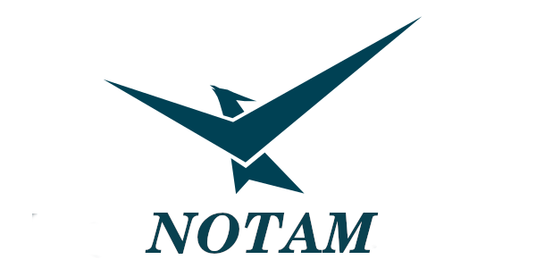
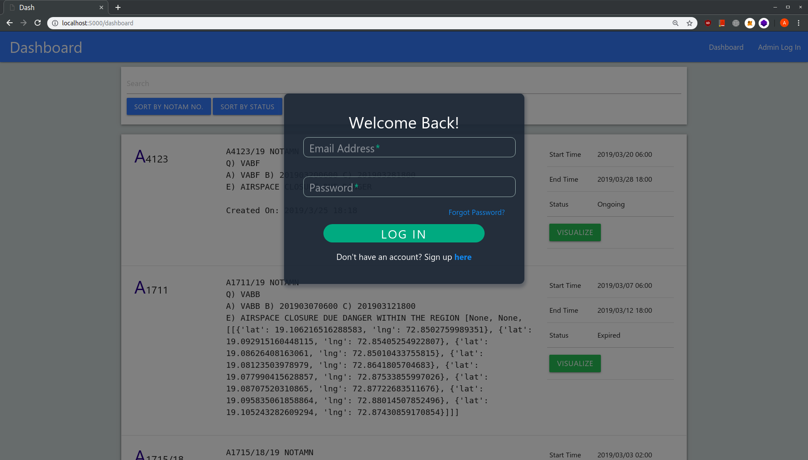
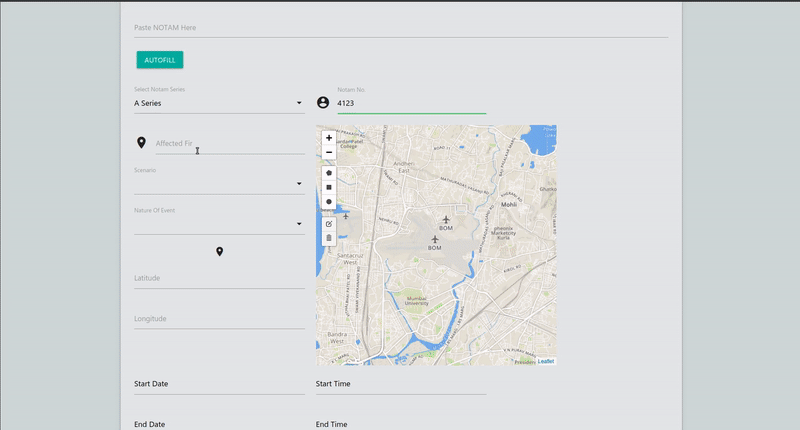
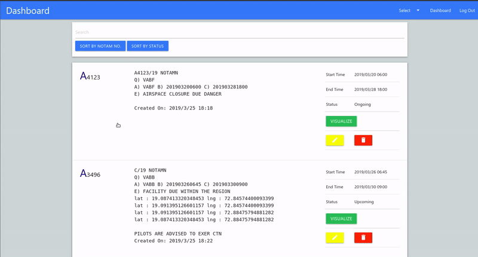
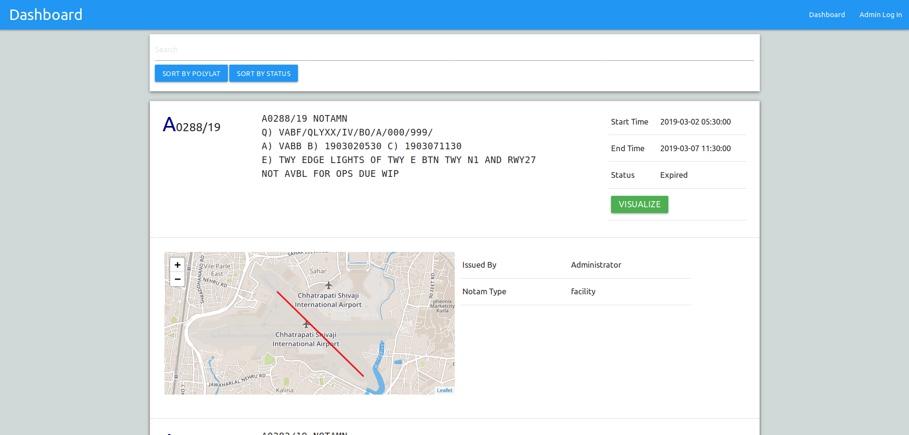

 

<h3 align="center">Natty Operation of Tedious Aviatory Messages</h3>

 

------------------------------------------

> **NOTAM** actually stands for **Notice To Airmen** and is the primary means of disseminating all kinds of information to pilots. Some of this information can be of critical importance.

> This system has gone through very few changes since its invention in the 1920s, even though the number of airports and airplanes that operate have increased exponentially over the years. 

> This project aims at simplifying the process of publishing and accessing a NOTAM as well as attempts to simplify the information presentation for quicker understanding.

> This project does not require any proprietary API or product. 

##### Web-App

  

  

  
 
  

------------------------------------------

### Features
- [x] Simplified, parameterized creation of NOTAMs
- [x] Instant and easy access to all published NOTAMs
- [x] Automatic map view generation whenever applicable.
- [x] Automatic highlighting of various parts of the aerodrome such as runways, taxiways etc whenever they are closed or unserviceable.
- [x] Search and sorting of NOTAMs based on user input.
- [x] Two step verification for administrator login.

------------------------------------------
### Contributing
 We're are open to `enhancements` & `bug-fixes` :smile: Also do have a look [here](./CONTRIBUTING.md)

### Note

 This project was done under `36 hours with minimal pre-preparation`

------------------------------------------
### Contributors

- [@Korusuke](https://github.com/Korusuke)
- [@Rusherrg](https://github.com/RusherRG)
- [@hetzz](https://github.com/hetzz)
- [@aditya1999](https://github.com/aditya1999)
- [@akshay-99](https://github.com/akshay-99)
- [@aviiiij](https://github.com/aviiij)

------------------------------------------

This repository / project was a part of **Smart India Hackathon 2019** under **Ministry of Civil Aviation, Government of India.**
